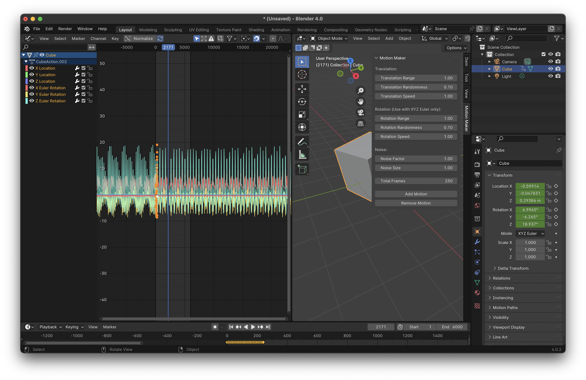

# Motion Maker

Blender addon to add natural motion to objects.

## Installation

1. Download the latest zip file.
2. In Blender, go to `Edit > Preferences > Add-ons > Install`.
3. Select the downloaded zip file and click `Install Add-on`.
4. Enable the addon in the preferences.

For more of my open source projects keep and eye on my site: 
https://bigandtallrecords.com/code

## Usage

Go to `View3D > Motion Maker` to use the addon.

A Blender addon for making any object wiggle or wobble based off of the origin.
 

 If you like my open-source software you may also like my music
 https://bigandtallrecords.com/music

 Dontations welcome
 https://www.paypal.com/paypalme/DanielOdom

If donations aren't your thing then perhaps a mug with Klaus Schwab's face on it?

 

If so! Then please visit: https://bigandtallrecords.com/merch

Love
Daniel 
❤️❤️❤️

