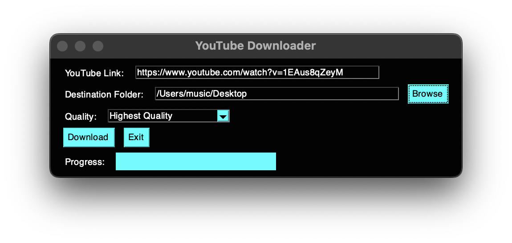
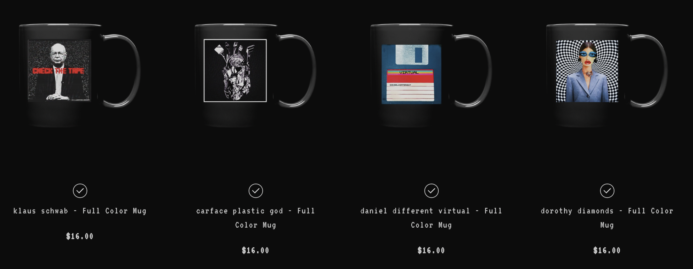

## Youtube Link Downloader

A free open-source Youtube link downloader GUI. Quality settings and audio-only mode.

For more of my open source projects keep and eye on my site: 
https://bigandtallrecords.com/code

dontations welcome
 https://www.paypal.com/paypalme/DanielOdom

❤️

## Requirements

- Python 3.10
- [PYsimplegui] https://pypi.org/project/PySimpleGUI/
- [ffmpeg](https://ffmpeg.org/)
- [pip install yt-dlp] https://github.com/yt-dlp/yt-dlp
- [brew install yt-dlp] for mac
- for Mac make sure both brew and ffmpeg are in path

## Installation

1. Clone the repository:
   ```bash
   git clone https://github.com/bigandtallrecords/youtube.git
   cd youtube
   ```
2. ````
   pip install PySimpleGUI 
   pip install yt-dlp]
   #or
   brew install PySimpleGUI
   brew install yt-dlp
   ``````

 ## Usage
 - mac - python3 "youtube.py"
 - pc - python "youtube.py"

 

 If you like my open-source software you may also like my music
 https://bigandtallrecords.com/music

 Dontations welcome
 https://www.paypal.com/paypalme/DanielOdom

<span style="color: #ff69b4;">If donations aren't your thing then perhaps a mug with Klaus Schwab's face on it?</span>

 

If so! Then please visit: https://bigandtallrecords.com/merch

Love
Daniel 
❤️❤️❤️

